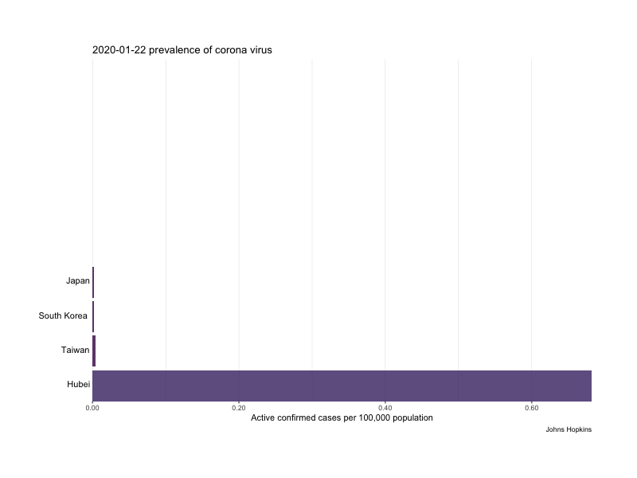
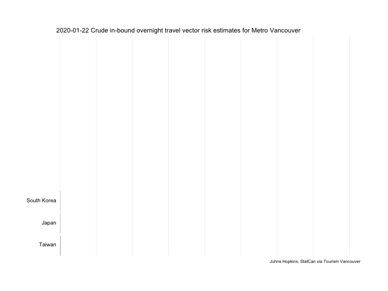

<i>(Joint with Nathan Lauster and cross-posted at <a href="https://homefreesociology.com/2020/03/04/overnight-visitors-and-travel-vectors/" target="_blank">HomeFreeSociology</a>)</i>

The spread of Coronavirus is reminding us of just how often people travel around, especially as various locations become quarantined and international travel corridors get shut down. So let's take a look at some basic data on travel patterns here of relevance to us here in Vancouver. Then we'll put them back in the context of Coronavirus.

TLDR: travel data is really interesting, don't be frightened of travellers, and there's still a lot we don't know about coronavirus

We've looked at the movement of people before in terms of [migration](https://homefreesociology.com/2017/05/05/good-age-specific-net-migration-estimates-come-in-threes/), [immigration](https://homefreesociology.com/2019/06/17/gateway-communities-of-vancouver/) and [commuting patterns](https://doodles.mountainmath.ca/blog/2020/01/06/flow-maps/). But these are movements that are either regularized, everyday, and routine (e.g. commuting) or shuffle people between one settled set of routines and another (e.g. migration). Travel data gives us something different, representing something more like the unsettled movement of people. People travel for work, to visit family, and of course, for tourism. The Tourism Industry is interested enough in travel data that they ask Statistics Canada to compile data for them. Stats Canada combines Canadian travel surveys and border crossing administrative data to get us a decent look at overnight stays. So it is that we get overnight stayer data for Vancouver!

Let's look at where people are visiting Metro Vancouver from. The [Tourism Vancouver data](https://www.tourismvancouver.com/about/research/) has an interesting selection of countries available, with special breakdowns for Canada and the USA. More than a quarter of all overnight stays in Metro Vancouver are trips from elsewhere in British Columbia. Another quarter plus of trips arrive from elsewhere in Canada, with Ontario and Alberta leading the way. The USA accounts for just under a quarter of overnight visits. Altogether, Canada and the USA account for over 8 million of the roughly 10 million visits. Most American visitors to Metro Vancouver arrive from nearby neighbours down the Pacific Coast (WA, OR, CA), which together account for over half of travel from the USA. About as many people visit from all of Mexico as from nearby Oregon (140k).

Of the slightly less than two million international visitors from beyond NAFTA borders, a little over half arrive from Asian/Pacific countries, with most of the remainder from Europe. China, the UK, and Australia, Japan, India, and Germany each accounted for more than 100k visitors in 2019, South Korea, Hong Kong, and Taiwan not far behind. Let's put all these flows together on a map.

<iframe width="800" height="600" src="https://flowmap.blue/1WFgU9dpg0w-OKOpAnq45qjIxdrK5FshkS18XMVpmG40/embed" frameborder="0" allowfullscreen></iframe>

Of some concern, lots of the places identified above have had recent outbreaks of Coronavirus. We're still in early days of tracking the virus. And we know it's already having major effects on travel. But can we look at current prevalence estimates and recent travel patterns to give some insights into crude vector risks for Metro Vancouver? Maybe. But it's worth keeping in mind that everything is still pretty much up in the air in terms of what we know!

First let's look at up-to-date active confirmed Coronavirus cases drawing on data collected at [Johns Hopkins](https://systems.jhu.edu/research/public-health/ncov/).

Wuhan, of course, appears as the centre of the outbreak, and Hubei Province in China contains most of the active confirmed cases to date (as of March 03, 2020!) The number of cases is important to track, obviously, and the starting point for healthcare workers and epidemiologists alike. But focusing on these numbers can provide a misleading impression of how widespread the Coronavirus has become. So let’s come up with a crude estimate of prevalence instead of case numbers. Here we're going to use active confirmed cases as our starting point. Another option is to track all confirmed cases, including those who have recovered (no longer testing positive) or died from coronavirus. But active confirmed cases might arguably give us a better sense of current spread. 

We can plot the evolving nature of active confirmed cases in terms of prevalence estimates across places, effectively dividing total number of active confirmed cases by population for our data reported so far. Setting this to motion, we can track outbreaks by prevalence across time. Even just looking at active confirmed cases, we get a sense that recorded prevalence has recently stopped climbing for Hubei province. Meanwhile, outbreaks in South Korea, Iran, Hong Kong, and the nearby state of Washington continue to grow. Also worth noting, some countries (e.g. South Korea) seem to have a better handle on testing the virus, providing better confidence in their numbers. The numbers coming out of other locales (Iran and the USA) seem far less reliable, either because of inconsistent testing, untrustworthy reporting by officials, or both. This sets a real limit on what we can know so far.

Overall it needs to be stressed that - given the numbers we have so far - the prevalence of coronavirus is still very low. Even in Hubei province, the centre of the outbreak, not much more than a single active confirmed case per thousand people has been confirmed. Comparing locations of cases to surrounding populations, most places around with the world with outbreaks still see only about one active confirmed case per hundred thousand people. Even setting aside the hyper-cautious mood around the world and its effects on travel, if you met a visitor from one of these places in Metro Vancouver, fairly unlikely that they would be a carrier. There's little reason to be scared of individual travellers!

But what about travel patterns writ large? Surely even if any individual presents a very low risk as a vector, by sheer number, the masses of people travelling through Vancouver from places with coronavirus outbreaks represent a risk. Indeed, that's how the coronavirus has spread so far. We can very crudely estimate this risk by setting a base likelihood that each individual traveller from a given outbreak location is coronavirus-free (1 - cases / population). In other words, we might use currently active confirmed cases as our measure of prevalence, estimating we can be 99.99975% certain that a given traveller from Washington State will not be a carrier for coronavirus. But what if a LOT of people travel from Washington? Then we exponentiate 99.99975% by the number of visitors (126,493 for the first three months of 2019 as a proxy) to come up with an estimate that none of these travellers carry the virus (we really should be drawing without replacement here, but this is a good approximation), with the complement giving a rough estimate of at least one visitor being a carrier. This comes out at 27% using our current estimates. This only considers Washington residents travelling to Vancouver and still neglects Vancouver residents travelling to Washington and getting infected there. And it relies on current active confirmed cases, it does not include active but not yet confirmed cases. And it assumes travel patterns similar to a year ago. Still, it provides us with a measure of vector risk to Metro Vancouver that combines risk of coronavirus with travel volumes.

Let's run with this for recent coronavirus outbreak data based on travel volumes similar to past years - EXCEPT excluding cases from Hubei province in China after January 23rd (when the quarantine went in place). What does our crude evolving overnight travel vector risk look like?

Here we can see rapidly changing vector possibilities. Conditions are changing fast! Still, it's hard to know how much to trust these numbers. Given what we understand about testing at the moment, it's likely we're still overstating the risk from high quality testing locales ([South Korea](https://www.nytimes.com/2020/03/02/health/coronavirus-testing-cdc.html#click=https://t.co/6lRUKPH5PH)), as well as understating the risk from places where testing has been poor (Washington) and places where we don't have any visitor data at all (Iran). We're also missing current data on how travel is changing as well as data on where people from Metro Vancouver are travelling, which is a big deal given that most of our cases so far represent returned travellers from abroad.

Here is a still of the most recent snapshot as of the writing of this.

## Upshot
So here are the big takeaways from our exercise: 1) Visitor data to Metro Vancouver is actually really interesting, even for those outside of the tourism business. 2) Don’t shun travellers from abroad! The likelihood of anyone you meet, even coming from an outbreak centre, being a carrier of coronavirus is very, very low. 3) The combination of travel patterns plus coronavirus prevalence gives us some interesting ways to model evolving vector risks in Metro Vancouver. 4) But it’s not clear how much we should trust our data. Travel patterns have surely altered, and we need better coronavirus testing fast, especially in places like Washington State.

Overall, integrating travel data with coronavirus data may, if nothing else, help people and agencies prepare and plan better. Practically any planning is better than some of the ad hoc decisions being made out there, as when American Airlines suspended its flights to Milan only after [pilots refused to fly there](https://www.cnbc.com/2020/03/01/united-postpones-new-pilot-class-amid-coronavirus-outbreak.html). For most people, the important thing is to listen to local health agencies, like the [BC Centre for Disease Control](http://www.bccdc.ca/health-info/diseases-conditions/coronavirus-(novel)), wash your hands, and be kind to those around you, wherever they come from. 

As usual, the code for the post is [available on GitHub](https://github.com/mountainMath/doodles/blob/master/content/posts/2020-03-03-overnight-visitors-and-crude-travel-vectors.Rmarkdown) in case anyone wants to refine or adapt it for their own purposes.

## Update (2020-03-04)
For a look at how the professionals are joining international travel data to coronavirus data, see [Gardner (et al) (now unfortunately outdated!)](https://systems.jhu.edu/research/public-health/ncov-model-2/)
