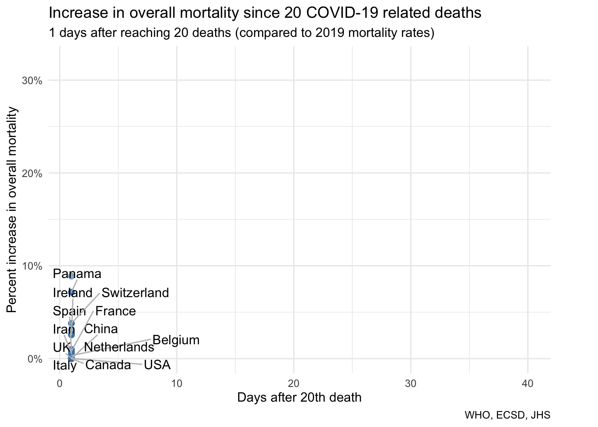
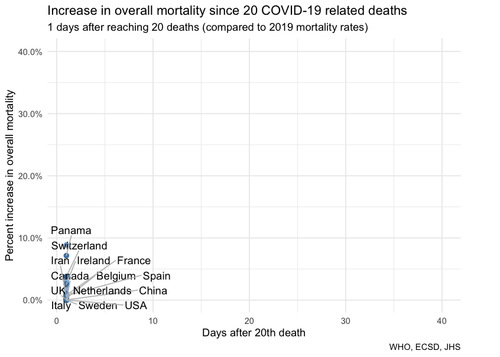

<i>(Joint with Nathan Lauster and cross-posted at <a href="https://homefreesociology.com/2020/04/01/context-for-covid-19-mortality-so-far/" target="_blank">HomeFreeSociology</a>)</i>

Unfortunately, more and more people are dying due to COVID-19. We won't know the full toll from COVID-19 for quite some time. But we can at least start to get a sense of its impact. One useful way of assessing the impact, of course, is just to [plot deaths attributed to COVID-19](https://mountainmath.ca/shiny/canada_covid-19/?_inputs_&level=%22country%22&metric=%22Deaths%22&start_cutoff=100). This highlights the real loss of human lives associated with outbreaks. But as any demographer can tell you, deaths are a normal part of life. Within a given population, we can reliably expect a certain number of deaths to occur over any given time period. So another way of visualizing COVID-19 deaths is also useful: How many deaths attributed to COVID-19 are occurring as compared to the deaths we would normally expect to occur? 

Below we follow the rise in deaths attributed to COVID-19 through time relative to the expected number of deaths that likely would have occurred without COVID-19 during the same time. 

This visualization places deaths reported from COVID-19 in the context of expected deaths overall. This helps establish where we know the mortality toll has already been enormous. As of March 31, the end-point of the animation, Italy leads the overall count in deaths attributed to COVID-19. Here we can also report that in just over a month, Italy's deaths so far attributed to COVID-19 already add more than 20% to its expected deaths. But Spain's toll relative to its expected number of deaths is ever higher. In just over three weeks time, we can see that COVID-19 already accounts for more than a 30% rise over the deaths that would've been expected without COVID-19. 

Unfortunately, most curves are still rising. So far. Initially curves grow exponentially, until aggressive containment or mitigation strategies flatten them. Curves that stabilize and flatten, or even begin to turn downward, reflect countries where deaths attributed to COVID-19 are being overtaken by deaths that might've been expected to occur anyway. Hopefully this reflects an outbreak coming increasingly under control - GOOD NEWS - rather than a data gap.

But the possibility for data gaps is very real. It will be quite awhile before we can properly estimate the overall toll from COVID-19. We already have preliminary data on deaths attributed to COVID-19 rolling in. But this data will be messy, excluding cases where COVID-19 was missed as a cause, despite being present, and possibly over-including cases where the cause was actually not COVID-19 (e.g. instead common influenza), or COVID-19 was present but the death should be attributed primarily to a different underlying condition claiming the life. Cause of death data is never clean to begin with. As COVID-19 overwhelms medical systems and coroners' offices, we should fully expect that  data quality will suffer further. 

More concretely, COVID-19 deaths will [show up in the mortality databases with code U07.1 or U07.2](https://www.who.int/classifications/icd/covid19/en/) in the current ICD-10 classification system (or RA01.0 and RA01.1 once ICD-11 comes into effect). But many will likely also get classifed as J11, J18 or J22. When the dust settles, we will have to check how these cases have evolved over time and estimate how many cases in 2020 (or late 2019 in the case of China) are likely misclassified COVID-19 cases.

We will also eventually get data about [overall mortality](https://www150.statcan.gc.ca/n1/pub/91-209-x/2018001/article/54957-eng.htm). We will likely see deaths increase beyond those attributed directly to COVID-19. Deaths will rise both in response to complications introduced by COVID-19 in those with pre-existing conditions, and in response to people dying due to failure of overloaded medical systems to be able to respond to non COVID-19 cases they way they normally would. At the same time, some other non-COVID deaths may go down. This can happen when COVID-19 claims lives that otherwise might've been claimed by something else (e.g. an underlying condition). But it can also relate to deaths that don't occur due to lockdown and the measures related to dealing with COVID-19. For instance, the regular toll of influenza may diminish in response to the lockdown targeted at Coronavirus (making it unclear what the "expected" baseline case count for 2020 should be). Similarly, fewer cars on the road will likely result in fewer deaths from car accidents. For references, see the most [common causes of death in Canada](https://www150.statcan.gc.ca/t1/tbl1/en/tv.action?pid=1310039401) in normal years [here](https://www150.statcan.gc.ca/t1/tbl1/en/tv.action?pid=1310039401). A similar discussion of the eventual breakdown we'll need in mortality data can be found in this [demographer thread](https://twitter.com/AndrewNoymer/status/1241620288825167874) attempting to summarize some of this complexity via twitter feed.

The mortality data coming in bears watching, both in terms of COVID-19 attributed deaths and deaths overall. Some analysts (e.g. in [Italy](https://www.corriere.it/politica/20_marzo_26/the-real-death-toll-for-covid-19-is-at-least-4-times-the-official-numbers-b5af0edc-6eeb-11ea-925b-a0c3cdbe1130.shtml) and [Spain](https://twitter.com/robertwiblin/status/1244586008282267649)) as well as some [China skeptics](https://time.com/5811222/wuhan-coronavirus-death-toll/?utm_source=twitter&utm_medium=social&utm_campaign=editorial&utm_term=health_covid-19&linkId=85197362), are already drawing upon anecdotal mortality data to suggest that the toll from COVID-19 is far greater than revealed in the official data so far. These kinds of analyses are especially potent when applied to cities and regions as opposed to countries. But ultimately it will take years for demographers to sort this all out. In the meantime, we can at least get a rolling sense of COVID-19's toll by looking at deaths attributed to Coronavirus relative to deaths otherwise expected based on past data from the same rough period of time. 

As usual, the code for the post is [available on GitHub](https://github.com/mountainMath/doodles/blob/master/content/posts/2020-03-31-context-for-covid-19-mortality-so-far.Rmarkdown) in case anyone wants to refine or adapt it for their own purposes.

## Update (2020-04-06)
It's been a week since we posted this, and things are changing fast with covid-19 related deaths increasing exponentially and background mortality estimates only increasing linearly with time. The traces in the animated GIF already highlight this, but here is a quick update of what the graph looks like using data from a week later.

And for completeness, here is the static graph with the latest availabel numbers.

