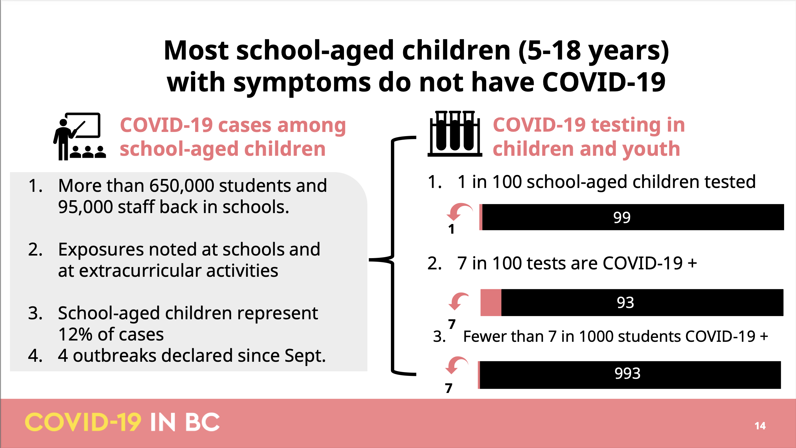
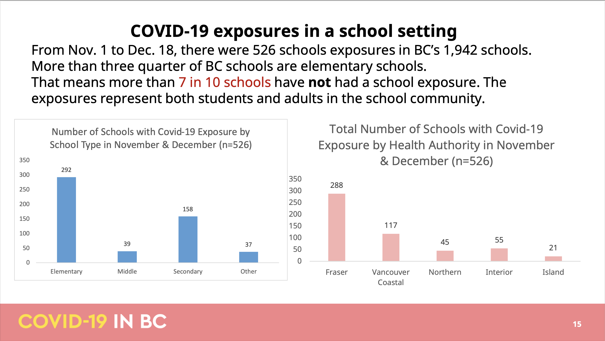
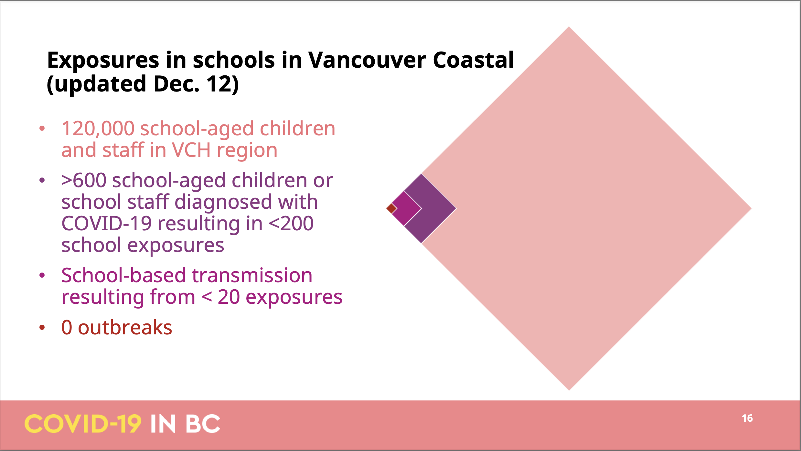
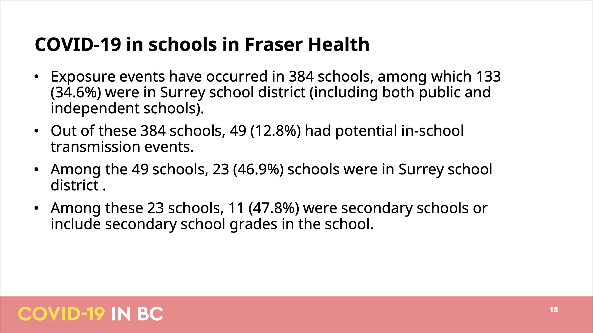

<i>(Joint with HsingChi von Bergmann, health science education researcher,  professor at UBC Faculty of Dentistry, previously associate professor and science teacher educator at UofC)</i>

Schools across BC [are set to resume this coming Monday, January 4th](https://globalnews.ca/news/7550277/bc-back-to-school-uk-covid-variant/). Meanwhile British Columbia universities have delayed the start of the semester by a week to gauge the fallout from Christmas and New Year celebrations, and other Canadian provinces with [similar case rates](https://github.com/mountainMath/BCCovidSnippets/blob/main/two_covid_canadas.md) are delaying their school starts, [Ontario by at least a week](https://www.todocanada.ca/ontario-delays-opening-for-in-person-learning-in-schools-after-winter-break/), [Manitoba will keep grades 7 to 12 in remote learning for two weeks while younger children can choose between remote and in-class learning](https://www.cbc.ca/news/canada/manitoba/manitoba-teachers-remote-learning-january-2021-covid-19-1.5826396), and [Regina is keeping students in remote learning for the first week after the break](https://www.cbc.ca/news/canada/saskatchewan/regina-public-schools-remote-learning-covid-19-1.5831360). The discovery of the new UK variant, which is thought to have [higher transmission rates and may have higher infectiousness among children](https://www.imperial.ac.uk/media/imperial-college/medicine/mrc-gida/2020-12-31-COVID19-Report-42-Preprint-VOC.pdf) adds to these concerns.

Resuming schools immediately after winter break is in line with BC's libertarian approach to COVID-19 that relies on recommendations instead of robust public health measures, leaving vulnerable populations to protect themselves. The failure to protect our most vulnerable reaches across all strata, but it can most easily be seen when looking at the case rates among our seniors, in particular the 90+ year olds.

This failure to protect our seniors is amplified by the high death rate of cases in that age group, and by the fact that many live in Long Term Care homes and are unable to protect themselves and instead have to rely on public health guidance and protocols to protect them. And we failed them miserably.

For families with immune-compromised or otherwise vulnerable household members this means parents have to decide whether to send children back to school on January 4th, without the benefit of better gauging the effect of the holidays. And without even knowing the case counts for the three previous days, as BC is not reporting cases on weekends or holidays and four days of data will only come in once school is out on Monday afternoon.

The latest reasoning behind the official BC school guidelines are explained in the [December 23 modelling presentation](https://news.gov.bc.ca/files/COVID19_Monthly_Update_Dec_2020.pdf) starting on page 13, so let's take a closer look.

## Modelling update slide 14

There are several issues with this slide, it's hard to know where to start. Probably the most problematic aspect of this slide is that it very misleading. People that have been following the pandemic in BC and are familiar with basic math will easily see through this, but the same can't be said for some journalists 

This tweet has fortunately been deleted by now, but it serves as a good example to show just why the slide is so misleading to laymen. The slide is doing a string of calculations aimed at minimizing the impact of COVID-19 on schools, leading the journalist to misrepresent the positivity rate as 7 out of 1000 instead of 7 out of 100. Of course the whole pretext in the slide is set up to encourage such misrepresentation, starting with the vacuous headline that "most school age children with symptoms don't have COVID-19", the same is of course true for any other age group in BC. After all, the age-specific positivity rates in BC [top out at roughly 12%](https://twitter.com/LetsFishSmarter/status/1340127156211306498?s=20) and the statement would remain true even if positivity rates for public symptom-based testing would go up to 49%.

Moreover, as anyone familiar with elementary school mathematics will notice, there is more going on here. If 1 out of 100 students get tested and 7 out of 100 test positive, then 7 out of 10,000 students have been confirmed to have COVID-19, not 7 out of 1000 as the slide suggests. In other words, at least one of these three statements on the slide is wrong. Which one we can't say for sure because the BCCDC has so far refused to release data on school age children, but we can try and triangulate things. Instead of school age children, the province does release data on children under 10 and children aged 10-19. While these are not the same, looking at these two groups can give a reasonable expectation of where school age children may land.

Let's start with the last metric and look at the incidence of COVID-19 among K-12 children.

Overall case counts were low for the first part of the pandemic, initially because we severely under-tested and then because case counts were low over summer. With the start of our second wave in June we see a continuous increase in the incidence of COVID in children. The provincial modelling slides don't give information over the timeframe, but between the start of school on September 8th and the time of the modelling update on December 23rd we have 0.4% of children below 10 and 0.8% of children between 10 and 19 being confirmed with COVID-19, so the overall prevalence of "fewer than 7 out of 1000" seems reasonable.

Next up is the positivity rate of 7% for children. This one is tricky, as the province is still refusing to release data on public testing volumes and public testing positivity rates. But we now have graphs in the weekly Situation Reports that give information on public testing and public testing positivity rates, and [Brett Favaro](https://twitter.com/LetsFishSmarter/status/1340127156211306498?s=20) has been racking up karma points by digitizing the provincial graphs on age-specific positivity rates and presenting them in a more convenient form. 
Strikingly, the positivity rate for 10-14 year old children spiked at 11% for the week ending December 12th, the last date for which we have testing data with the next update due on January 8th. 

(Yes, BC is refusing to provide data on public testing so that people resort to scraping it out of graphs, but even then BC goes without an update on public testing data for several weeks, meanwhile tricking the public and journalists into using the misleading testing data that includes private testing that severely skews testing volumes and positivity rates that's available via the dashboard and data download. But [that's another post](https://doodles.mountainmath.ca/blog/2020/12/21/covid-testing-data-in-bc/).)

And we only have data back to the last two weeks of October, so we are missing a month and a half of the school semester. But the available time frame does coincide roughly with the time of rapid case growth, so we should not be too far off by just using this time frame. To estimate the overall positivity rate for school age children, which was much lower at the beginning of the time period, we also need to know the overall number of tests performed on children, which we don't have. As the number of assumption we have to put into this is getting out of hand we might as well just eyeball it off of Brett's graph and take the week of November 15 through 21 as an estimate for the overall time period. That yields positivity rates of about 5.5 for <10yo, 8% for 10-14yo and 8% for 15-19yo, which is in the same ballpark as on overall rate of 7%.

Which leaves us with the last stat that 1 in 100 school age children got tested for COVID-19. While we don't have data, the [Situation Reports](http://www.bccdc.ca/Health-Info-Site/Documents/COVID_sitrep/Week_50_BC_COVID-19_Situation_Report.pdf) has a graph depicting this, and we can scrape out the data, or for our purpose just eyeball it off the graph. It shows an "average weekly testing rate per 100,000" of roughly 1000 for each of the three school age children age groups for Phase 3b, so starting September 13. That's not quite the same thing as saying 1 in 100 school age children got tested per week as some children got tested more than once, for example taking both, a NPS and gargle test. But accounting for that, plus noting that there were 15 weeks in the school year, we get to roughly 1 in 10 children getting tested and not 1 in 100 as claimed in the provincial modelling report. Mystery solved, although this exercise makes it abundantly clear how hard it is to fix provincial incompetency without access to proper data.

## Modelling update slide 15

The next slide is about "COVID-19 exposures in a school setting", specifying a date range between Nov 1 and Dec 18, claiming "there were 526 schools exposures" in BC schools in that time frame. However, the [BC COVID School Tracker](https://bcschoolcovidtracker.knack.com/bc-school-covid-tracker#home/) volunteer project lists 1,392 exposure notifications in this time frame. This glaring discrepancy is readily resolved by noting that the province, in it's effort to downplay school exposures, somewhere along the editing process reduced "exposures in 526 schools" to (the grammatically questionable) "526 schools exposures". And indeed, the school tracker project's 1,392 exposures occurred in 577 different schools, with the remaining small discrepancy likely due to questions about whether to use the notification or one of the exposure dates as underlying date variable. The next sentence confirms the reading by concluding that "7 in 10 schools have not had a school exposure" while applying ample text highlighting. And the following graph title also states correctly that the 512 refers to the number of schools not the number of exposures, although the graphs are fairly useless as they aren't normalized by school population, continuing with embarrassingly poor data visualization. (Pro tip, if you give out the raw data and others will likely volunteer to clean it up and make more informative graphs for the benefit of everyone, including the government.)

The biggest issue with the slide is that what matters is the number of exposures, not the number of schools. If one school received 24 school exposure notifications (actually two schools received this many in Fraser Health), then that is not something that should get trivialized into saying this is a "school with COVID-19 exposure". That school had 24 separate exposure notifications, 24 times when parents were considering if they should continue to send their kids to school the next couple of days, 24 times the parent rumour mill is trying to understand how close the case was to their particular kids, 24 times where parents are disparately trying to learn if the index case wore a mask, and 24 times the parents second-guess the Health Authority definition of "close contact" (in a province that still officially ignores aerosol-based spread and still negates that pre-symptomatic transmissions play a significant role). Let alone the worries all teachers and staff have had in these high-exposure schools. No one should have to go to work in such a high risk environment without more stringent health and safety measures being implemented first. Schools have been [prevented by the public health office to implement more stringent measures, for example requiring mask use at all times, in the past](https://www.cbc.ca/news/canada/british-columbia/port-moody-principal-forced-to-retract-in-class-mask-policy-1-day-after-introducing-it-1.5709461).

Trivializing these 24 exposure notifications by equating them to a school that had 1 is an affront to the anxiety and grief that these 24 exposure notifications cost parents, children, teachers and staff.

## Modelling update slide 16
The following slides try to fill in some of the missing context in the previous slide by looking at schools in Vancouver Coastal and Fraser. 

Page 16 normalizes number of students and staff exposed in Vancouver Coastal by the overall school population, which is good. In true BCCDC fashion is using a different (and hard to pin down) timeframe from the previous slide, underscoring yet again that the BCCDC is incapable of systematic analysis on things like school exposures but has to rely on a patchwork of incoherent  bits and pieces to build their understanding. 

But let's go with the slide and read this as exposures up to December 12th. The slide claims that

* there were over 600 cases associated with the fewer than 200 exposures
* school-based transmissions occurred for fewer than 20 of these exposures

Not much of this information can be independently verified, but the BC COVID School Tracker project listing 313 school exposures in Vancouver Coastal in this time frame. It's hard to say how to best resolve this, maybe Vancouver Coastal used a different timeframe, or Vancouver Coastal skipped the exposures from the beginning of the school year when VCH was refusing to inform the public on school exposures against the PHO expectations, or some other reason.

But taking the information at face value it leaves us to guess about 400 out of 600 infected students or staff that did not result in an exposure notification. Some of these will be the result of in school-transmissions, which we are reassured only occurred in the context of "fewer than 20" exposures. But even allowing for multiple transmissions in a single exposure, this does not add up. And that's not even accounting for the fact that the timelines of COVID are such that we won't be able to isolate most close contacts before they become infectious and thus most close contacts should result in another exposure notification in the case that they did become infected. For some cases pubic health may have determined that they weren't at school during their infectious period, maybe someone developing symptoms and testing positive on a Tuesday after a long weekend and betting that the person likely wasn't infectious on the Friday before, given that the [the density of infections is only about one quarter four days before symptom onset](https://www.nature.com/articles/s41591-020-0869-5). Some decisions about cutoffs have been made depending on risk tolerance, although the parent's risk tolerance may differ from public health's risk tolerance. Either way, all this reasoning is unlikely to explain the 400 

Overall, this slide raises more questions than it answers. And the rotated tiled square visualization does not help.

## Modelling update slide 17

This slide has more details on the settings in which cases among students and staff got infected. The first bullet states that they were able to link 89% of all school related case to another case. The second is probably the most alarming, pointing out that one quarter of all school related cases were in staff. So staff are over-represented in school cases, which makes sense given our testing protocol that focuses exclusively on symptomatic cases likely misses about half of student cases.

Third bullet point rules out in-school transmissions as a cause for over 90% of cases, which is a bold statement given the inherent uncertainties that comes with case linking. At the very least this should qualify that it's only looking at confirmed transmissions between confirmed cases.

For most of it there is no way to verify the information provided in the slide, although we can use the snapshot of data on school transmissions that was shared previously, but we will have to focus on students by picking the respective (somewhat broader) age groups and looking at overall BC data.

This shows that out of the roughly 695 cases of children below 20 that were linked to a probable transmission case and setting, about 116, or 17%, were identified to be in a school setting. Given that this includes cases of non-school aged children and young adults, and this also does not take into consideration of cases where transmissions were determined to possibly have occurred in multiple settings (labelled by BCCDC as "unnamed setting"), for example a case where the transmission may have occurred within a household or within school, the claim that fewer than 10% of transmissions happened in school seems to imply that almost all teachers were determined to have contracted COVID-19 outside of school and on top of that transmission patterns have shifted or are different in Vancouver Coastal compared to overall BC.

## Modelling update slide 18 

The last slide regarding schools is about Fraser Health, the hardest hit health authority. It continues with the questionable practice of focusing on schools that had exposure events instead of the number of exposures. The BC COVID School Tracker project details 1,289 exposure events across 390 schools, with the discrepancy in the number of schools perfectly explained when cutting the notification data off at the date of the press conference and some coming in after that. It details that 133 public and independent schools in Surrey school district had at least one exposure event. The Ministry of Education counts 110 public and independent schools in Surrey, implying that around 121% of Surrey schools have had at least one exposure event, many of which had multiple exposure events.

The slide goes on to detail that 12.8% of schools had one or multiple "potential in-school transmission events", which is telling in that it allows for uncertainty in case linking when cases pop up in schools after exposure events by labelling those as "potential" in-school transmissions, yet at the same time rules out the possibility of missing cases and transmission events due to e.g. the high rate of asymptomatic cases in children. Of course this selective bias is again perfectly consistent with the overall theme of public health working to minimize in-school transmissions in these slides.

## Conclusion
This turned out to be a very long post, what's the takeaway? Public health messaging on schools continues to be frighteningly bent on minimizing in-school exposures and transmissions, going as far as producing slides that are misleading enough to trick journalists into obviously false statements. Basic mathematics continues to elude BCCDC, with slides apparently undergoing zero quality control where inconsistencies resulting in numbers being off by an order of magnitude slipping through unnoticed.

The BCCDC analysis on schools continues to be a patchwork of disparate approaches, time intervals and mini-stats that make it impossible to paint a comprehensive picture. It is very hard to believe that the BCCDC does have consistent statistics internally, but for some reason decided to release an incoherent patchwork publicly. The alternative, that the BCCDC has no clear picture themselves, is frightening. But it's hard to come up with an alternative reasonable explanation of this mess.

## Are schools safe?
The short answer is, we don't know. The BCCDC doesn't make relevant data publicly available and the modelling presentation instills little confidence that the BCCDC has paid sufficient attention to this.

Can schools be made sufficiently safe? We believe the answer is Yes in almost all cases. The basic mechanics are clear. If community transmissions is low there will be few in-school exposure events and school can resume with our minimal distancing protocols, including cohorting and wearing of masks outside the classroom, augmented by ensuring proper ventilation, in order to minimize the chance of in-school transmissions. But if the level of community transmission rises we will need to strengthen in-school protocols accordingly to keep the frequency of in-school transmissions low. The obvious low-hanging fruits are to require mask wearing at all times and pay extra attention to ventilation, but if community transmissions rise to the high levels we have e.g. seen in parts of Surrey, we will need to consider split in-person and remote learning setups and even school closures until schools can again be operated safely. Not doing so means leaving families with vulnerable household members fend for their own health and safety.

We could, if the BCCDC would choose to do so, monitor community transmissions at the school district (or finer) geographic level to assist in this. We could use the federal funding to improve ventilation in schools as [outlined in BC's Back to School plan](https://www2.gov.bc.ca/gov/content/education-training/k-12/covid-19-return-to-school). Providing timely and actionable data, as well as clear justifications of school protocols based on clearly cited research, can help restore confidence in public health policies regarding schools.

At the same time we should support remote learning options any family that decides to pull their children out of school because e.g. they have immune-compromised household members.

As usual, the code to pull in the data and make the graphs is [available on GitHub](https://github.com/mountainMath/doodles/blob/master/content/posts/2021-01-02-bc-back-to-covid-school.Rmarkdown) in case anyone wants to reproduce or adapt them.

## Addendum (Feb 17, 2021)
We were made aware that [Réka Gustafson wrote a response to our blog post](/data/Briefing%20Note%20-Response%20to%20PHSA%20board%20regarding%20blog%20on%20schools.pdf), embedded below for convenience. We will not go into too much detail, but briefly address two main points.

Gustafason's response further highlighted how the BCCDC slides weren't the result of a coherent analysis on the situation in schools, but a mishmash of incoherent points, made with data from constantly shifting time frames and other ad-hoc slices of the data. To illustrate: the response to point 1 slide 14 claimed that the data on slide 14 being correct, but each data point was constructed from a different time window. Why anyone would slice data this way, let alone present that to the public, is byond our understanding.

Similarly, the response to point 4 slide 17 reiterated the point that VCH school transmission data are very different from overall BC data, highlighting the piecemeil approach taken. 

We are noting that Gustafson's insistence in their confident statements about transmissions in BC schools are hard to justify simply because that a large fraction of children with COVID-19 remain asymptomatic, many of whom will be missed by BC's testing protocol. Gustafson's statements are based on confirmed cases and determined likely transmission routes, the latter of which is necessarily biased by public health priors. Statements like "for the vast majority of these [...] further transmission does not occur in the school" fail to reflect the large uncertainties inherent in the underlying data.

As a takeaway Gustafson writes that
>    Going forward, presentations will be reviewed to ensure dates and details are added either directly to the slides, or to an appended document, to minimize the likelihood of misinterpretation.

Reviewing slides before presentation and providing more in-depth description of the methods are critical for transparent and effective communication. But the main problem isn't that slides were missing details, it's that there was no coherent analysis of COVID-19 in schools underlying this presentation in the first place. If there was a coherent analysis there would be no need for this confusing mix of metrics scattered across the slides.

<iframe src="/data/Briefing%20Note%20-Response%20to%20PHSA%20board%20regarding%20blog%20on%20schools.pdf" width="100%" height="600px"/>

